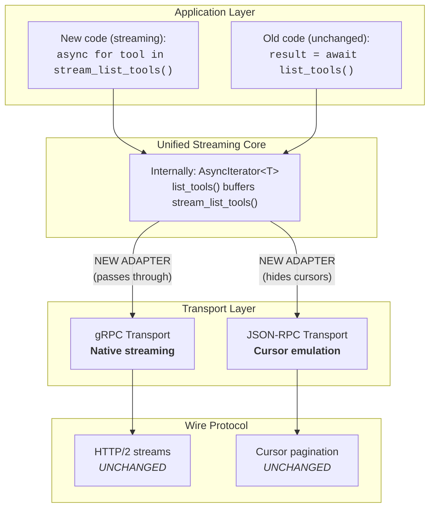
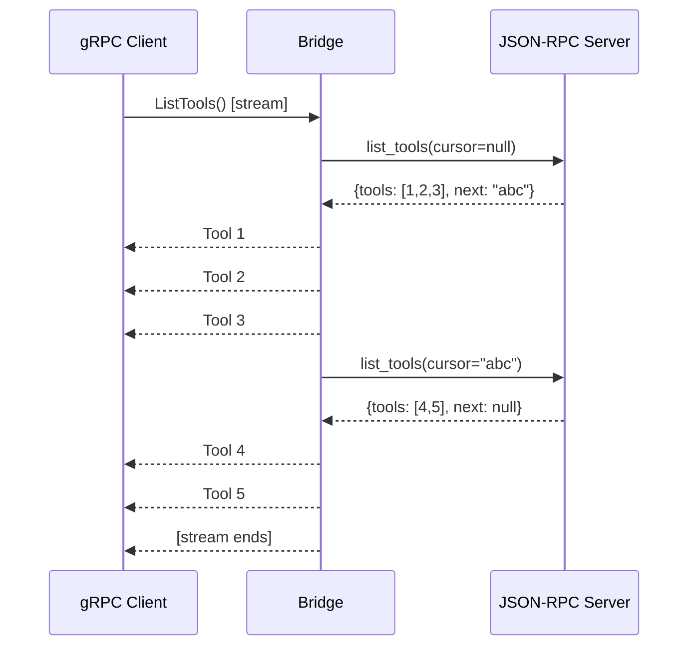

# MCP Streaming Transport Proposal

## Problem Statement

MCP's current transport architecture uses cursor-based pagination as the primary abstraction. This works well for JSON-RPC transports but forces gRPC implementations into "fake streaming" - buffering complete results before yielding items one-by-one.

| Layer | Current Behavior | Issue |
|-------|------------------|-------|
| gRPC Server | `result = handler()` then `for item in result: yield` | Server loads all items into memory before streaming |
| gRPC Client | `items = []; async for r in stream: items.append(r)` | Client buffers entire stream into list |
| Interface | `list_tools() -> ListToolsResult` | Forces complete results, no streaming option |

The streaming is cosmetic - it happens at the transport layer but provides no memory or latency benefits end-to-end.

## Transparent Tunneling

Make streaming the internal abstraction while maintaining full backward compatibility. Non-streaming transports remain unaware of the streaming layer.



## Architecture

### Transport Implementations

| Transport | `stream_list_tools()` Implementation | Overhead |
|-----------|--------------------------------------|----------|
| gRPC | `async for resp in stub.ListTools(): yield convert(resp)` | None (native) |
| JSON-RPC | Iterate cursor pages, yield items from each | Cursor management (hidden) |
| SSE | Iterate cursor pages, yield items from each | Cursor management (hidden) |

### StreamingAdapter

```python
class StreamingAdapter:
    """Provides streaming interface over any transport."""

    def __init__(self, transport: ClientTransportSession):
        self._transport = transport

    async def stream_list_tools(self) -> AsyncIterator[types.Tool]:
        if isinstance(self._transport, GrpcClientTransport):
            # Native streaming - no overhead
            async for tool in self._transport._stream_list_tools_native():
                yield tool
        else:
            # Cursor-based - iterate pages internally
            cursor = None
            while True:
                result = await self._transport.list_tools(cursor=cursor)
                for tool in result.tools:
                    yield tool
                cursor = result.nextCursor
                if cursor is None:
                    break

    async def list_tools(self) -> types.ListToolsResult:
        """Backward compatible - collects stream into result."""
        tools = [t async for t in self.stream_list_tools()]
        return types.ListToolsResult(tools=tools, nextCursor=None)
```

### Cross-Protocol Bridging

For deployments mixing gRPC and JSON-RPC:



The bridge is the only component that understands both protocols.

## Compatibility of the Bridge Approach

### Compatibility Matrix

| Component | Knows Streaming? | Knows Cursors? | Changes Required |
|-----------|------------------|----------------|------------------|
| gRPC Transport | Yes (native) | No | None |
| JSON-RPC Transport | No | Yes (native) | None |
| StreamingAdapter | Yes | Yes | **New** |
| Old application code | No | Via `list_tools()` | None |
| New application code | Optional | Hidden | None |
| Cross-protocol Bridge | Yes | Yes | **New** |

### Non-breaking change

Given the success of the current MCP protocol, it is important to note that this proposal does not change the JSON-RPC wire protocol.  Cursor pagination would remain the same. All current servers and clients running wouldn't need to be updated. This does not force the concept of streaming to the non-streaming MCP calls. It is fully backward compatible.

We get the best of both worlds: native streaming and backward compatibility.

## Benefits of bridging approach

1. **gRPC gets native streaming** - no buffering overhead
2. **JSON-RPC unchanged** - cursor pagination continues working
3. **Application code is uniform** - same interface regardless of transport
4. **Opt-in complexity** - only bridge deployments need to understand both
5. **Future-proof** - new streaming transports plug in without SDK changes

