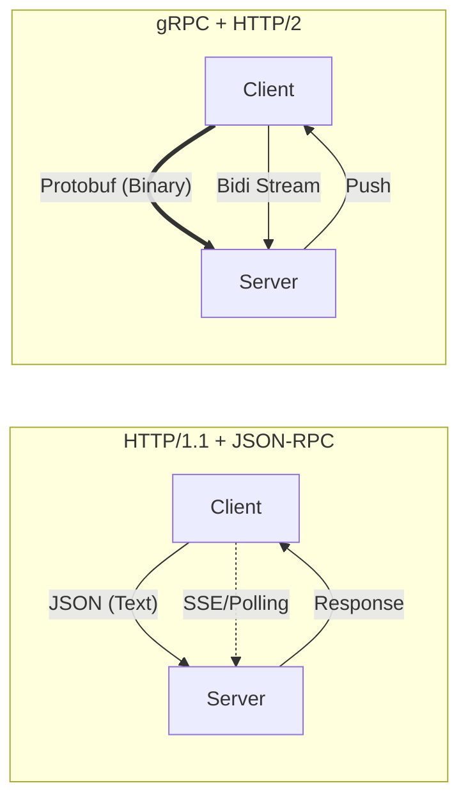
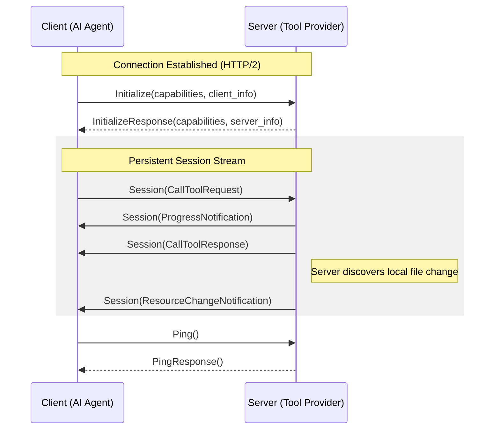

# MCP gRPC Transport

This directory contains the Protocol Buffer definitions for MCP as a gRPC service. This provides an alternative to HTTP/1.1 that addresses its limitations: lack of streaming, JSON's type safety issues, memory footprint, and processing speed.

## Why gRPC for MCP?

MCP over HTTP/1.1 uses JSON-RPC, which works well but has limitations for high-throughput or streaming use cases. A gRPC implementation addresses these limitations:



This proposal also introduces a tunneling layer for interoperability between streaming and cursor-based transports. See [README-MCP-TUNNELING-PROPOSAL.md](README-MCP-TUNNELING-PROPOSAL.md) for details.

### Differences from JSON-RPC

*   **Bidirectional Streaming**: Replaces SSE and long-polling with a persistent HTTP/2 stream for interleaved requests, progress updates, and server notifications.
*   **Binary Serialization**: Protobuf is ~10x smaller and faster to parse than JSON, especially for large blobs or many small tool calls.
*   **Native Bytes**: Uses `bytes` for resource data instead of Base64 encoding.
*   **Flow Control**: HTTP/2 flow control prevents servers from being overwhelmed by fast clients (and vice versa).

---

## Architecture & Lifecycle

The gRPC transport implements `ClientTransportSession`, the same interface used by SSE, WebSocket, and stdio transports.

### The Session Flow

Unlike traditional unary calls, a gRPC MCP session often starts with an initialization handshake and then moves into a long-lived bidirectional stream.



---

## Service Definition

The `McpService` exposes all MCP operations as RPCs. It supports both unary calls and streaming variants:

```protobuf
service McpService {
  // Lifecycle & Health
  rpc Initialize(InitializeRequest) returns (InitializeResponse);
  rpc Ping(PingRequest) returns (PingResponse);

  // Tools: Supports parallel execution and progress streaming
  rpc CallTool(CallToolRequest) returns (CallToolResponse);
  rpc CallToolWithProgress(...) returns (stream CallToolWithProgressResponse);

  // Resources: Large resource streaming
  rpc ReadResourceChunked(...) returns (stream ReadResourceChunkedResponse);
  rpc WatchResources(...) returns (stream WatchResourcesResponse);

  // Bidirectional multiplexed stream
  rpc Session(stream SessionRequest) returns (stream SessionResponse);
}
```

### Implementation Notes

1.  **Implicit Chunking**: The Python implementation defaults `read_resource` to the chunked streaming RPC. This prevents memory spikes when reading large resources (logs, database exports, etc.).
2.  **Background Watchers**: Resource subscriptions use background stream observers, so the client receives push notifications without blocking the main event loop.
3.  **Unified Session**: The `Session` RPC multiplexes operations. A single TCP connection handles concurrent tool calls while receiving resource updates.

---

## Development & Tooling

### Building the Stubs

To use this protocol in Python, you need to generate the gRPC stubs. **Note:** Due to the internal import structure of generated Protobuf files, we generate stubs into `src` which creates the appropriate package hierarchy.

```bash
# Generate Python stubs
python -m grpc_tools.protoc \
  -I proto \
  --python_out=src \
  --grpc_python_out=src \
  proto/mcp/v1/mcp.proto

# This creates:
# src/mcp/v1/mcp_pb2.py        (Standard messages)
# src/mcp/v1/mcp_pb2_grpc.py   (gRPC client/server stubs)
```

### Dependencies

Ensure your environment has the necessary gRPC libraries:

```bash
uv add grpcio grpcio-tools
```

---

## Status

**Current Status:** `Alpha / Experimental / RFC`

The core protocol is stable and implemented in the Python SDK's `GrpcClientTransport`. We are actively seeking feedback on the `Session` stream multiplexing patterns before finalizing the V1 specification.

## References

- [Official MCP Website](https://modelcontextprotocol.io)
- [Original gRPC Proposal](https://cloud.google.com/blog/products/networking/grpc-as-a-native-transport-for-mcp)
- [gRPC Documentation](https://grpc.io/docs/)

## Design Decisions

### Streaming over Pagination

In HTTP/JSON-RPC, paginating large lists (like `ListTools` or `ListResources`) is standard practice to manage payload sizes. gRPC offers native streaming (`stream Tool`), which allows the server to yield items one by one.

**Decision:** Streaming is the primary API for gRPC. List request messages include an optional `page_size_hint` field to help bridges limit memory when translating to cursor-based transports.

### Stream Termination Semantics

For direct streaming RPCs (e.g., `ListTools`), stream EOF signals completion naturally. However, the bidirectional `Session` stream stays open across multiple operations, requiring explicit completion signals via `SessionResponse`.

**Solution:** List responses are simple (just the item), and Session uses top-level control messages:

```protobuf
// Direct RPC: simple response, stream EOF = done
message ListToolsResponse {
  Tool tool = 1;
}

// Session stream: control messages in SessionResponse
message SessionResponse {
  oneof payload {
    ListToolsResponse list_tools = 12;
    StreamEnd stream_end = 55;    // Completion signal
    StreamError stream_error = 61; // Error signal
  }
}
```

| Operation Type | Completion Signal |
|---------------|-------------------|
| Direct streaming RPC | Server closes stream |
| Session list operation | `SessionResponse.stream_end` with matching `request_id` |
| Session watch operation | Continues until `CancelRequest` or error |
| Tool with progress | `ToolResult` or `StreamError` in response |

### Backpressure Behavior

| Transport | Backpressure | Behavior |
|-----------|--------------|----------|
| gRPC | Native (HTTP/2 flow control) | Server slows if client can't keep up |
| JSON-RPC | None (request-response) | Client controls pace via cursor requests |

This is an inherent transport difference. Applications requiring backpressure should use gRPC or similar streaming transports.

### Streaming Adapter Pattern

For interoperability between streaming (gRPC) and cursor-based (JSON-RPC) transports, we use a transparent tunneling layer. See [README-MCP-TUNNELING-PROPOSAL.md](README-MCP-TUNNELING-PROPOSAL.md) for details.

```python
class StreamingAdapter:
    async def stream_list_tools(self) -> AsyncIterator[Tool]:
        if isinstance(transport, GrpcTransport):
            # Native streaming - pass through
            async for tool in transport._stream_list_tools_native():
                yield tool
        else:
            # Cursor-based - iterate pages internally
            cursor = None
            while True:
                result = await transport.list_tools(cursor=cursor)
                for tool in result.tools:
                    yield tool
                if not result.nextCursor:
                    break
                cursor = result.nextCursor
```

## Implementation Notes

### True Streaming vs. Buffering

The gRPC transport layer supports streaming, but the current Python SDK `Server` implementation operates with buffered lists.

*   **List Operations:** Handlers for `list_tools`, `list_resources`, etc., typically return a full `list[...]`. The gRPC transport iterates over this list to stream responses, meaning the latency benefit is "transport-only" rather than "end-to-end" until the core `Server` supports async generators.

*   **Resource Reading:** Similarly, `read_resource` handlers currently return complete content. The gRPC transport chunks this content *after* loading it into memory. Zero-copy streaming from disk/network to the gRPC stream requires updates to the `Server` class to yield data chunks directly.

### Binary Content Encoding

`ImageContent` and `AudioContent` use base64-encoded strings rather than native `bytes`:

```protobuf
message ImageContent {
  string data = 1;      // Base64 encoded for JSON-RPC compatibility
  string mime_type = 2;
}
```

**Rationale:** Maintains semantic equivalence with MCP JSON-RPC payloads. For large binary data, prefer `ReadResourceChunked` which uses native `bytes` for efficiency.

### Request Metadata

All list and streaming requests include optional `RequestMeta` for correlation and tracing:

```protobuf
message RequestMeta {
  string trace_id = 1;       // OpenTelemetry trace ID
  string correlation_id = 2; // Application-level correlation
  map<string, string> extra = 3;
}
```

This provides parity with JSON-RPC metadata since gRPC metadata is out-of-band.
